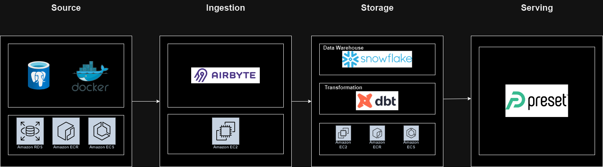

# Project plan 

## Objective 
Provide insights on Dvd rental trends and performance

## Consumers 
Managers, executives and customers

## Questions 
> - Who are the top 10 customers?

> - What are the top 10 popular categories, actors?
> - What is the average duration of the rental?
> - Is there a correlation between film category and rental period?
> - Category demand in each store vs available inventory

## Source datasets 
What datasets are you sourcing from? How frequently are the source datasets updating?

| Dvd Rental | PostgreSQL database |

## Preset visualisation

## Solution architecture

## Breakdown of tasks 
Mark:
 - AWS Set up
 - Data Modelling
 - Transformation
 - Documentation

Khuong:
 - Ingestion (Airbyte)
 - Write Tests (dbt)
 - Git repository set up
 - Documentation
